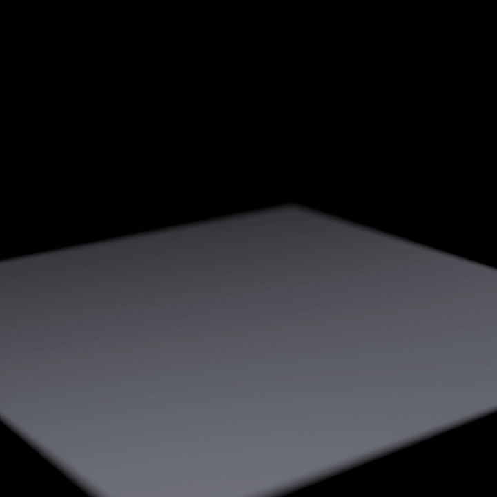

# MPM Sand Reproduction

This repository contains an in-progress C++ reproduction of the sand model from:

- Klár et al. 2016, `Drucker-Prager Elastoplasticity for Sand Animation`

Current scope:

- `3D single-species dry sand`
- `explicit APIC/MPM`
- `Hencky/log-strain elasticity`
- `Drucker-Prager plastic projection`
- `hardening`
- scene configuration, particle export, preview rendering, and Blender-based final rendering

Current non-goals:

- full 2016 supplementary alignment
- implicit solve from `Algorithm 2`
- 2017 water-sand coupling

## Quick Start

Build and run a scene:

```bash
bash ./build.sh release scenes/pile_lab.json
```

Export simulation frames:

```bash
./build/Release/klar2016_sand \
  --scene scenes/pile_lab.json \
  --steps 2400 \
  --export \
  --output-dir outputs/.test/pile_lab_case
```

Render with Blender:

```bash
export BLENDER_BIN=~/blender-5.0.1-linux-x64/blender

bash ./scripts/render_pile_lab_blender.sh \
  outputs/.test/pile_lab_case/frames \
  outputs/.test/pile_lab_case/pile_lab.mp4 \
  scenes/pile_lab.json
```

Testing convention:

- trial and preview outputs go under `outputs/.test/`
- approved outputs that you decide to keep can be promoted into `outputs/`

Commit hook:

- run `git config --local core.hooksPath .githooks` once in this clone
- every commit will then run `scripts/check_no_absolute_paths.py` on staged files
- use `python3 scripts/check_no_absolute_paths.py --all-tracked` to scan the whole repo manually

## Documentation

- [Docs Index](docs/README.md)
- [Class Diagram](docs/CLASS_DIAGRAM.md)
- [Current Status](docs/CURRENT_STATUS.md)
- [Roadmap](docs/ROADMAP.md)
- [Skills Registry](SKILLS.md)
- [References](references/README.md)
- [AI Disclosure](AI_DISCLOSURE.md)

## Current Example Output

[](outputs/pile_lab_dense_check_v2/pile_lab_paper_like_v1.mp4)

- [Preview GIF](outputs/pile_lab_dense_check_v2/pile_lab_paper_like_v1.gif)
- [Paper-like pile render (MP4)](outputs/pile_lab_dense_check_v2/pile_lab_paper_like_v1.mp4)
- [Last frame](outputs/pile_lab_dense_check_v2/pile_lab_paper_like_v1_last.png)
