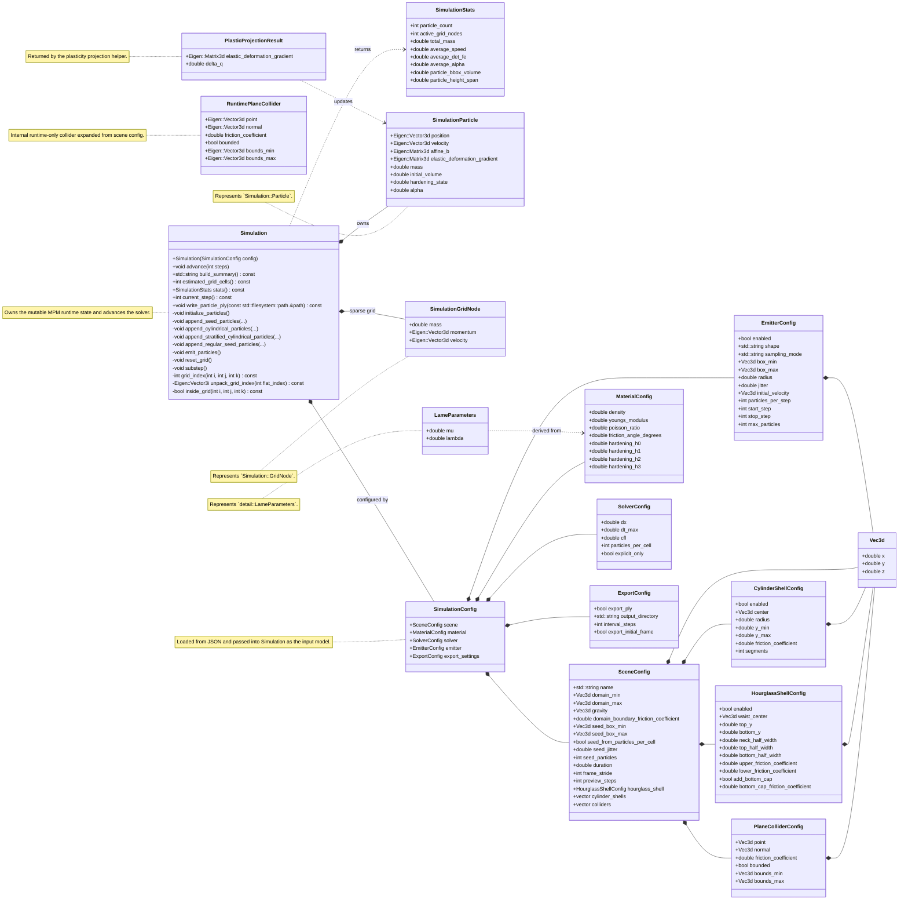

# UML Class Diagram

This diagram summarizes the refactored solver-facing types and the main ownership
relationships between configuration, runtime state, and internal helper data.

## Reading Order

- Start with `SimulationConfig` to see how scene input is structured.
- Then read `Simulation` and its nested `Particle` and `GridNode` types.
- The `detail::` structs are internal implementation helpers and are not part of the public API.
